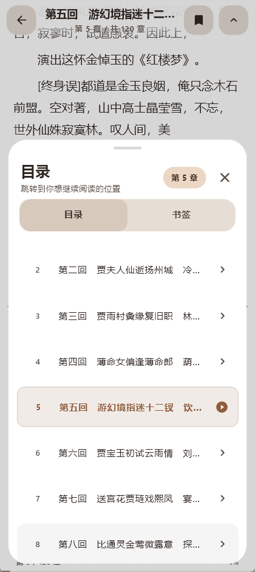
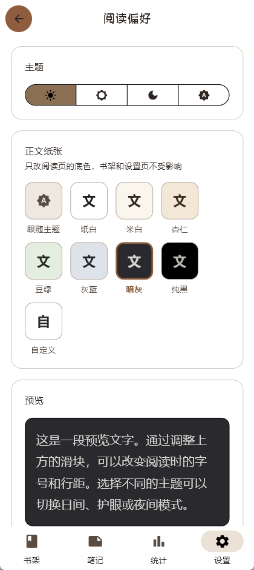
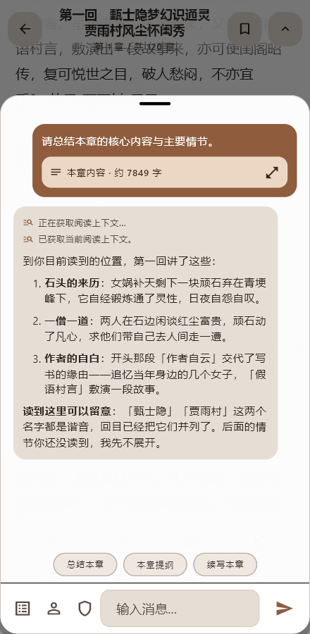
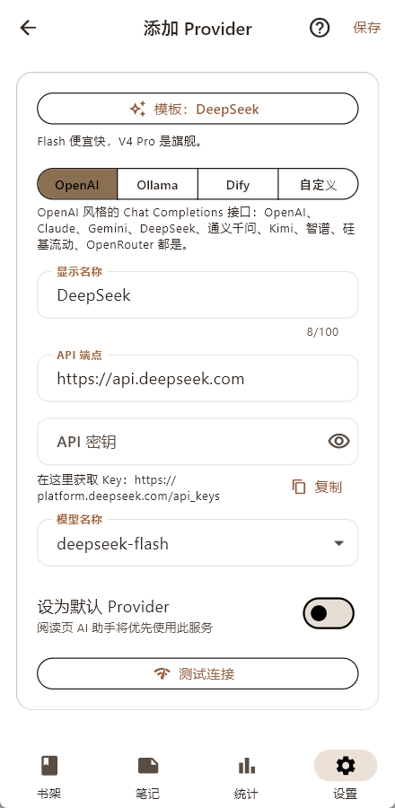
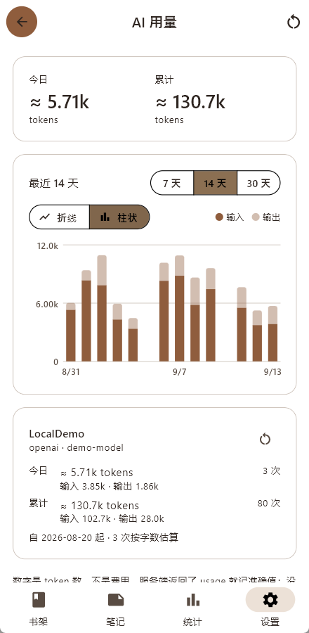

#  芸窗 Yunchuang

本地阅读器。读 EPUB / PDF / TXT，做笔记，划词查词典、记生词、翻译，听 TTS，问 AI。数据存在本机，除 AI 与翻译外不联网。

Android · Windows · MIT

> 芸香草能防蠹，古人拿它护书；芸窗是书斋的雅称。

## 下载

[Releases](https://github.com/yarizm/Yunchuang/releases) 提供两种包：

| 平台 | 文件 | 要求 |
|------|------|------|
| Android | `yunchuang-<版本>-android-arm64-v8a.apk` | 64 位 ARM 设备，Android 7.0+ |
| Windows | `yunchuang-<版本>-windows-x64.zip` | Windows 10+，解压后运行 `yunchuang.exe` |

截图里的示例书目来自 [Project Gutenberg](https://www.gutenberg.org/)，均为公有领域作品；AI 回答用的是本地假服务，只为展示界面。

## 书架

分组（一本书可属多个书架）、系列、阅读状态、网格 / 列表视图、排序、封面与元数据编辑。

桌面端可把文件或文件夹拖进窗口；Android 可从文件管理器「打开方式」或其他应用分享进来。导入时自动识别 GBK / GB18030 / UTF-16 等编码，TXT 按中英文章节标题自动分章。


## 阅读

| 格式 | 说明 |
|------|------|
| EPUB | 可选中文本、划词菜单，封面按规范读取 |
| PDF | 页面渲染，划词查词、加生词本，横屏可双页 |
| TXT | 自动分章，自动识别编码 |

- 滚动 / 分页两种模式，分页有仿真、滑动、简洁三种翻页效果
- 阅读进度精确到章节内位置，退出再进回到原处
- 手机可设「阅读时横屏」：进阅读器自动转横屏，退出恢复


### 目录与跳转

目录、书签、跳转历史：从目录、搜索结果或 AI 引用跳走之后，可以一键回到上一个阅读位置。



### 排版与纸张

字号、行高、边距、段距、字距、字体、对齐、段首缩进：全局默认，可按书覆盖。

正文底色独立于全局主题：白 / 米白 / 杏仁 / 豆绿 / 灰蓝 / 暗灰 / 纯黑，或自选底色，字色按对比度自动配。想黑底白字读书，不必把书架和设置页一起变暗。



### EPUB

EPUB 正文按 HTML 的空白规则转成文本：硬换行折成空格，汉字之间不留空格，脚注链接可点。Gutenberg 一类按固定宽度硬换行的 EPUB 读起来和正常排版一样。


## 笔记

划线、高亮、写批注；标签分类、笔记间关联；笔记页按书分组，可按标签筛选。

- 导入：微信读书 HTML、Kindle `My Clippings.txt`、CSV、JSON
- 导出：Markdown、CSV


## 搜索

书名 / 作者、笔记、正文全文三处一起搜，结果直接跳到原文位置。中日韩文本走子串匹配（正文有 trigram 索引加速），其他语种走 FTS5。

## AI 助手

在阅读页里直接问。AI 带四个工具，按需调用：搜当前书、读章节摘录、搜笔记、读当前阅读上下文。回答下方列出引用来源，点一下跳回原文。

内置几个快捷问法（总结本章、本章提纲、续写本章），也可以自己定义技能（限定可用工具的预设指令）和角色人设（可从书中生成，和书里的人物对话）。

会话按书保存，可以随时换一个话题重新开始。



### 不剧透

**默认不剧透。** AI 能读到的内容截止到你当前的阅读位置，可全局设置或按书覆盖：

| 档位 | 行为 |
|------|------|
| 严格防剧透（默认） | 只检索当前阅读位置之前的内容 |
| 访问前询问 | 需要未读内容时先请求本次授权 |
| 允许全书 | 可检索后续章节 |

限制在工具执行层生效，越界章节不会进入模型上下文。


### 接入服务商

接 OpenAI 兼容接口、Ollama 或 Dify。内置 OpenAI、Claude、Gemini、DeepSeek、通义千问、Kimi、智谱、硅基流动、OpenRouter、Ollama、Dify 的接入模板：选一个，端点和模型自动填好，填上 Key 就能用。模型名可以直接从服务端拉取列表选，不用翻文档。

Key 只存在本机，备份不会带走它。



### 用量

每个 Provider 的 token 用量按天记录：今日 / 累计，输入 / 输出，折线或柱状图看最近 7 / 14 / 30 天。服务端返回了 usage 用准确值，没返回的按字数估并标注。

只是计数，不折算成钱——各家各模型的价格不一样。



## 词典、生词本、翻译

- 导入 StarDict 离线词典，划词即查，多词典可同时启用
- 生词本记录出处，可回到原文
- 划选文本翻译（发送给默认 AI Provider，仅在你点击时发送）

## TTS

断点续播、语速独立调节、朗读计时；迷你播放器和全屏控制面板。Android 接入媒体会话，通知栏可控、后台播放。

## 统计

今日 / 本周 / 本月 / 累计时长，连续阅读天数，单书时长排行，一年阅读热力图。


## 备份

一键导出 ZIP（数据库、书籍、封面、偏好、自定义背景图），从 ZIP 完整还原；可上传到自己的 WebDAV 网盘并设置每天 / 每周自动上传。备份不含 AI 密钥与 WebDAV 凭据。Android 系统自动备份已关闭，书库不会被同步到 Google Drive。

## 外观

Light / Sepia / Dark / 跟随系统。全局背景可选纯色、主题色渐变、内置插画或自己的图片，浓度可调，书架、设置和阅读页都看得见。


## 限制

| | |
|---|---|
| 平台 | 只有 Android 和 Windows |
| 格式 | 不支持 MOBI / AZW3 / FB2 |
| 同步 | WebDAV 只是备份包上传 / 下载，恢复整体覆盖本机，不合并两端改动 |
| 排版 | 未实现标点挤压与禁则，正文默认左对齐 |

不配 AI Provider 也能使用除 AI、翻译外的全部功能。

## 开发

```bash
flutter pub get
flutter run -d android    # 或 flutter run -d windows
```

生成的 `*.g.dart` 已随仓库提交，克隆后无需先跑 build_runner。修改 `lib/database/tables/` 或 `lib/database/daos/` 后重新生成：

```bash
dart run build_runner build
```

Android 签名：复制 `android/key.properties.example` 为 `android/key.properties` 填入 keystore 信息，再 `flutter build apk --release`。

设置环境变量 `YUNCHUANG_DATA_DIR` 可以把数据目录（数据库、书籍、封面）指到别处，用来试新版本或截图，不碰真实书库。

| 层 | 技术 |
|----|------|
| 框架 | Flutter 3.x（Dart ≥ 3.4） |
| 状态管理 | Riverpod 2.x |
| 路由 | GoRouter |
| 数据库 | Drift + SQLite + FTS5 |
| 测试 | flutter_test + mocktail，109 个测试文件 |

```
lib/
├── main.dart / app.dart    # 入口、四个底部 Tab
├── database/               # Drift 表定义与 DAO
├── models/                 # 领域模型
├── providers/              # Riverpod Provider；ai/ 下为 Provider 实现、Agent、剧透边界
├── services/               # 书籍 / 笔记 / 搜索 / TTS / 备份 / 词典 / 翻译 / 生词
├── parsers/                # 书籍解析器与笔记导入器
├── typography/             # 分页排版内核
├── pages/                  # 各页面
├── widgets/                # 共享组件
├── theme/                  # 主题与自定义路由
└── utils/                  # 断句、编码检测等
```

## License

MIT
